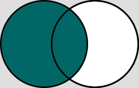

# SQL

- [SQL](#sql)
  - [Theoretical Questions](#theoretical-questions)
    - [What is SQL?](#what-is-sql)
    - [What is a primary key?](#what-is-a-primary-key)
    - [What is a foreign key?](#what-is-a-foreign-key)
    - [Order of execution](#order-of-execution)
    - [What is the difference between WHERE and HAVING?](#what-is-the-difference-between-where-and-having)
    - [What is a JOIN in SQL?](#what-is-a-join-in-sql)
      - [Types](#types)
        - [INNER JOIN](#inner-join)
        - [LEFT JOIN](#left-join)
        - [RIGHT JOIN](#right-join)
        - [FULL OUTER JOIN](#full-outer-join)
        - [Rows without intersection](#rows-without-intersection)
    - [What is a subquery?](#what-is-a-subquery)
    - [Difference between UNION and UNION ALL?](#difference-between-union-and-union-all)
    - [What is an index?](#what-is-an-index)
    - [What are aggregate functions?](#what-are-aggregate-functions)
    - [What is normalization in SQL?](#what-is-normalization-in-sql)
  - [Practical Questions](#practical-questions)

## Theoretical Questions

### What is SQL?

- SQL = Structured Query Language
- Used for managing and manipulating relational databases
- Used for querying, updating, inserting and deleting data and managing database schemas and permissions

### What is a primary key?

- Column (set of columns) that uniquely identifies each row in the table
- Must contain unique values
- Cannot contain NULL
- One primary key per table

### What is a foreign key?

- Column (set of columns) that links to primary key of another table
- Used to establish relationships between tables ensuring referential integrity

### Order of execution

1. FROM and JOINs
    - determine the data of interest
2. WHERE
    - filter out records that do not meet the condition(s)
3. GROUP BY
    - group the data based on some column(s)
4. HAVING
    - remove the created grouped records that do not meet the condition(s)
5. SELECT
    - derive all columns and expressions needed
6. ORDER BY
    - sort derived values
7. LIMIT and OFFSET
    - keep or skip specified number of rows

### What is the difference between WHERE and HAVING?

- WHERE:
  - filters row before grouping
- HAVING:
  - filter groups after aggregation has been applied (used with GROUP BY)
- See [Order of execution](#order-of-execution): WHERE comes before GROUP BY and HAVING

### What is a JOIN in SQL?

- JOIN &rarr; combines rows of two or more tables based on related column(s)

#### Types

##### INNER JOIN
- only rows with matching values

##### LEFT JOIN
- all rows of the left table and matching rows of the right table



##### RIGHT JOIN
- all rows of the right table and matching rows of the left table


##### FULL OUTER JOIN
- all rows of both tables

##### Rows without intersection

```
...
A FULL OUTER JOIN B
ON A.key = B.key
WHERE A.key IS NULL or B.key IS NULL;
```

### What is a subquery?

- Query nested inside another query
- Typically used to return a single value, set of values or table to use in outer query
- Can be used in SELECT, WHERE, FROM, HAVING

### Difference between UNION and UNION ALL?

- UNION:
  - Combines two or more queries and removes duplicates
- UNION ALL
  - Combines two or more queries and does not remove duplicates
  - Can improve performance

### What is an index?

- Database object that improves speed of data retrieval operations (quick access to rows)
- Created on columns that are frequently searched or used in JOINs
- Can slow down data insertion, updating and deletion

### What are aggregate functions?

- Perform calculations on a set of values
- Examples:
  - COUNT &rarr; number of rows
  - SUM &rarr; sum of numeric values
  - AVG &rarr; average of numeric values
  - MIN &rarr; smallest value
  - MAX &rarr; largest value

### What is normalization in SQL?

- Organizing data in database to reduce redundancy and improve data integrity
- Involves dividing large tables into smaller, more manageable tables and defining relationships between them
- Goal: Efficient data storage with low duplication and inconsistencies

## Practical Questions